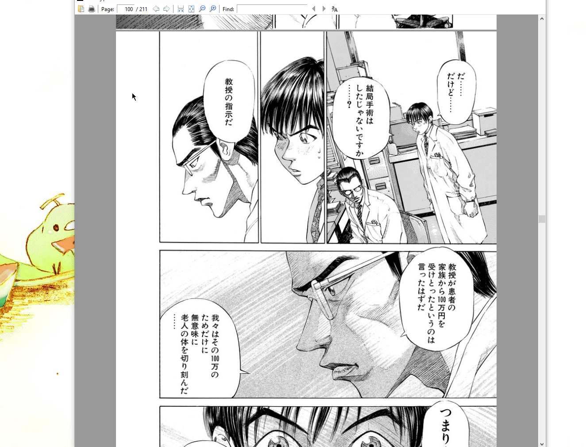

# jpocr

### A Japanese reading aid using google cloud vision API's optical character recognition. 

## Usage

1. You will need to [set up](https://cloud.google.com/vision/product-search/docs/before-you-begin) a google cloud project and enable the Cloud Vision API
2.  Set the environment variable`GOOGLE_APPLICATION_CREDENTIALS` to the path of your service account key
3. Install the python dependencies in the requirements.txt
4. Run `ocr_screenshot.py` and select the region to transcribe

