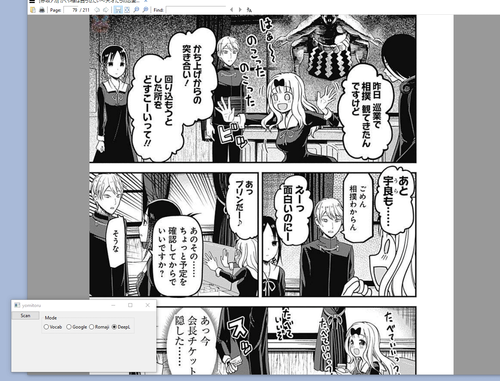

# yomitoru

    読み取る
    1. to read and understand; to take in
    2. to read (calibration, tape, etc.); to scan (bar code); to read (out)



### A Japanese reading aid built with Google Cloud Vision's OCR
Look up vocab definitions or directly translate captured text with deepL/google translate.
Output results to your terminal, or directly onto the screen (Windows only). The OCR results are also copied to the clipboard  such that they can be used with other translation/parsing tools.


## Usage

Run `yomitoru.py` and select the mode. Hit scan and select a region to transcribe.

## Installation

1. You will need to [set up](https://cloud.google.com/vision/product-search/docs/before-you-begin) a google cloud project and enable the Cloud Vision API

2. Set the environment variable`GOOGLE_APPLICATION_CREDENTIALS` to the path of your service account key

3. Install wxPython 4.1.0

   * `pip install wxPython` on windows and mac. macOS may also require running with `pythonw` (python.app) 

   * on linux `pip` will attempt to build wxPython. Binaries can be found [here](https://extras.wxpython.org/wxPython4/extras/linux/), you may need to install some missing libraries

     

4. Install the other python dependencies in the requirements.txt

   	* `pip install -r requirements.txt`
      	* download the necessary dictionaries for [fugashi](https://github.com/polm/fugashi) and [jamdict](https://github.com/neocl/jamdict) 

5. Configure yomitoru

   * If you have a deepL API key insert it into `secrets.py`

   * If the  captured temp.png files boundaries are off by a few pixels, adjust the follow lines in `yomitoru.py` to account for your window decorations.

     ```
     c1x_delta = 0
     c2x_delta = 0
     c1y_delta = 28
     c2y_delta = 15
     ```

     
